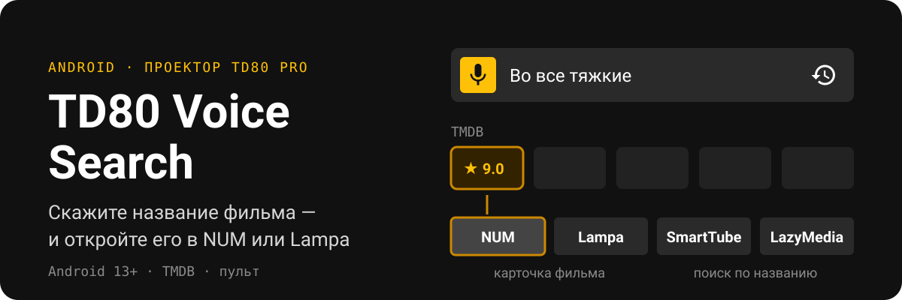
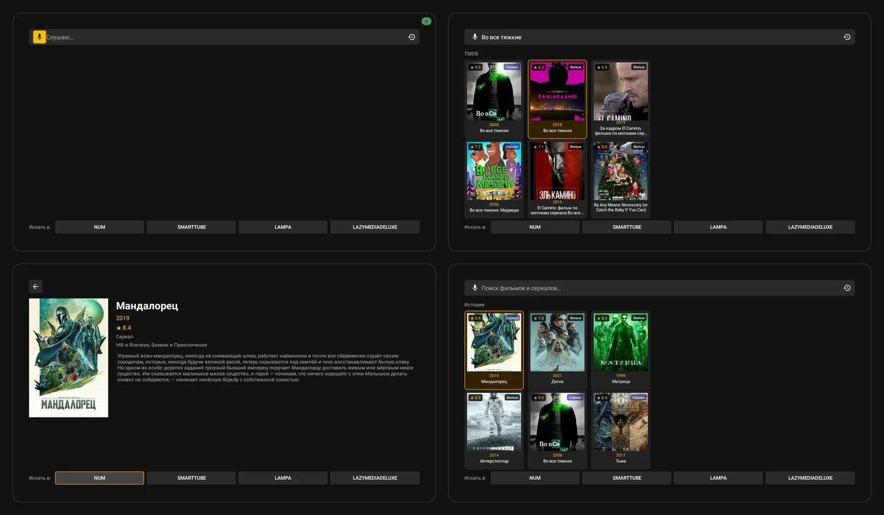

<p align="center">
  
</p>

<p align="center">
  <a href="https://github.com/aleksandrgrn/td80-voice-search/releases/latest"><b>Скачать APK</b></a>
  ·
  <a href="#установка">Установка</a>
  ·
  <a href="#сборка-из-исходников">Сборка</a>
</p>

Голосовой поиск фильмов и сериалов для Android-проектора TD80 Pro и похожих приставок без Android TV. Нажали кнопку на пульте, сказали «Во все тяжкие» — и сериал открывается в NUM или Lampa, без набора текста.

<p align="center">
  
</p>

## Что умеет

- **Поиск голосом или текстом** по каталогу TMDB: постеры, год, рейтинг, фильм или сериал.
- **Карточка фильма** с описанием и кнопками приложений.
- **Переход в приложение:**

  | Приложение | Что откроется |
  |---|---|
  | NUM | карточка этого фильма |
  | Lampa | карточка этого фильма (Lampa запускается около 30 секунд) |
  | SmartTube | поиск по названию на YouTube |
  | LazyMedia Deluxe | поиск по названию в её каталоге |

  Кнопки внизу главного экрана работают сразу из результатов: NUM и Lampa открывают верхний результат, SmartTube и LazyMedia ищут по запросу.
- **История** — кнопка справа от строки поиска. Хранит 20 последних открытых карточек: вышла новая серия — открыли сериал из истории, не произнося название заново.
- **Управление с пульта**, в том числе с радиопульта с USB-приёмником.

## Установка

1. Скачайте `td80-voice-search-1.0.0.apk` со [страницы релизов](https://github.com/aleksandrgrn/td80-voice-search/releases/latest) и установите.
2. Для голоса нужен **Speech Services by Google** (распознавание речи). Без него работает поиск текстом.
3. При первом запуске приложение попросит **ключ TMDB**: бесплатно на [themoviedb.org](https://www.themoviedb.org/settings/api), 32 символа.
4. Нажмите кнопку голосового поиска на пульте. Если система спросит, каким приложением выполнить действие, выберите «Голосовой поиск» → «Всегда».

Требуется Android 13 или новее.

## Как это работает

```text
кнопка на пульте → распознавание речи → поиск в TMDB → карточка
                                                        ├─ NUM / Lampa: ссылка themoviedb.org → карточка фильма
                                                        └─ SmartTube / LazyMedia: поиск по названию
```

Каталог NUM и Lampa — тот же TMDB, поэтому они открывают фильм точно. У SmartTube и LazyMedia каталог свой, туда уходит название.

## Сборка из исходников

```bash
./gradlew assembleRelease
```

Подпись release-сборки берётся из `local.properties` (`td80.keystore.path`, `td80.keystore.password`, `td80.key.alias`); без них Gradle соберёт неподписанный APK. Ключ TMDB в release не вшивается — пользователь вводит свой.

Kotlin, minSdk 33, OkHttp + Moshi, Coil, SpeechRecognizer. Тесты: `./gradlew testDebugUnitTest`.
